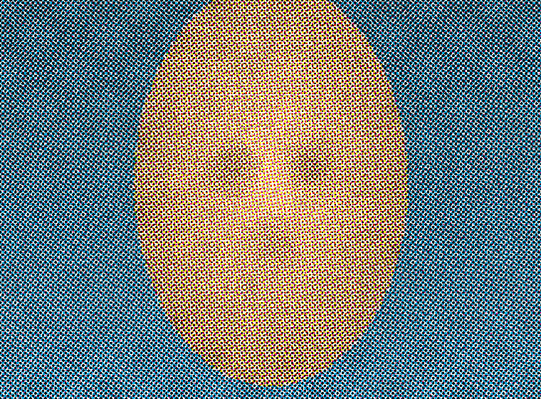

# Risograph — Halftone Print Studio

Turn any photo into a four-colour **risograph / CMYK halftone print**, right in
the browser. Pick an ink palette (or mix your own), dial in the screen angle and
dot density, and export a print-ready image. No uploads leave your device — all
processing runs locally in a Web Worker.



## Features

- **Halftone engine** — amplitude-modulated screens composited with a multiply
  blend, just like overprinting riso/CMYK plates. Circle, line (crosshatch),
  square and diamond dot shapes.
- **Two separation modes**
  - **Spot inks** — 1–5 inks, each anchored to a tonal range (highlights → mids
    → shadows) for the classic 2/3-colour duotone look.
  - **CMYK** — true four-colour process separation; re-ink any plate by changing
    its colour (fluoro pink instead of magenta, etc.).
- **Curated palettes** — Daydream (orange/blue), Full Press (CMYK), Rave
  (pink/teal), Newsprint, Orchard, Dusk… plus a full colour picker and editable
  paper stock.
- **Screen control** — per-ink screen angle, global dot density & size, dot
  shape, contrast, brightness, paper grain and mis-registration.
- **Export** — full-resolution PNG or JPG.
- **Responsive, designer-led UI** — editorial typography, a desktop control
  sidebar + informative plate rail, and a mobile layout that tucks secondary
  parameters into bottom-sheet menus.

## Tech

- [Vite](https://vitejs.dev/) + React + TypeScript
- [Tailwind CSS](https://tailwindcss.com/) with shadcn-style, hand-written
  components on [Radix UI](https://www.radix-ui.com/) primitives
- Canvas + Web Worker for off-main-thread rendering

## Develop

```bash
npm install
npm run dev      # start the dev server
npm run build    # type-check + production build to dist/
npm run preview  # preview the production build
```

## Deploy to GitHub Pages

This repo ships a GitHub Actions workflow
(`.github/workflows/deploy.yml`) that builds the site and publishes it to
GitHub Pages on every push to `main`.

1. In the repository **Settings → Pages**, set **Source** to **GitHub Actions**.
2. Push to `main` (or run the workflow manually). The site deploys to
   `https://<owner>.github.io/<repo>/`.

The Vite `base` is set to `./` (relative), so the build also works from a
sub-path, a custom domain, or `npm run preview` without further configuration.

## How the halftone works

Each enabled ink builds a per-pixel **amplitude map** (how much ink lands where):

- *Spot mode* maps each ink to a tonal level via a tent-shaped response, so
  highlights, mids and shadows are carried by different inks.
- *CMYK mode* decomposes RGB into cyan/magenta/yellow/black.

The map is then **screened**: the image plane is rotated to the ink's screen
angle, sampled on a fixed grid, and a dot whose radius tracks the local ink
amount is drawn in each cell. Overlapping screens at different angles multiply
together over the paper colour — producing the moiré weave that gives riso its
character.

## License

MIT
